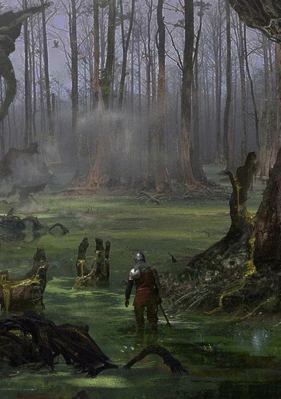
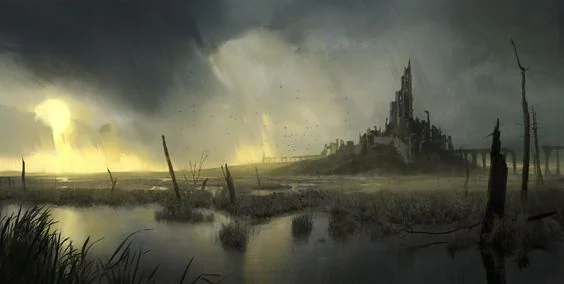

Eastern province of the Empire, this marshland is rich in a variety of herbs and insects used for medicinal, magical or esthetical pruposes. The main town of Tesagred is now suffering of a sinking problem. It is the Builder's guild most outstanding project to this day

<!-- onenote-media:start -->
> [!onenote-hero]
> 

> [!onenote-gallery]
> 
<!-- onenote-media:end -->

<!-- vault-enrichment:start -->
## Related

- [[settings/Middleworld/Regions/index|Geography]]
- [[settings/Middleworld/index|Introduction]]
<!-- vault-enrichment:end -->
