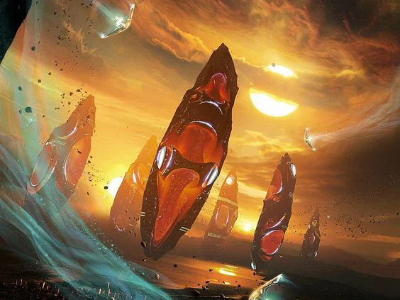
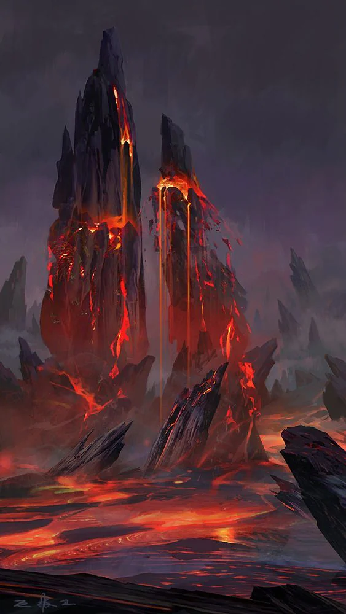
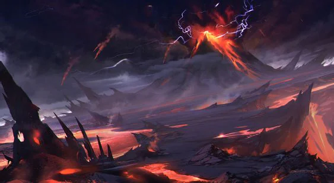

Point of impact of tall crimson menhirs. It has now corrupted the land and some suspect Lake menthis as well. It spreads slowly and little is known as to how to stop it. It covers a great surface of the planet.

<!-- onenote-media:start -->
> [!onenote-hero]
> 

> [!onenote-gallery]
> 
>
> 
>
> 
<!-- onenote-media:end -->

<!-- vault-enrichment:start -->
## Related

- [[settings/Middleworld/Regions/index|Geography]]
- [[settings/Middleworld/index|Introduction]]
- [[GM-thoughts/Middleworld/Founding Myth|Founding Myth]]
- [[settings/Middleworld/History/index|History]]
- [[settings/Middleworld/Maps/index|Maps]]
<!-- vault-enrichment:end -->
