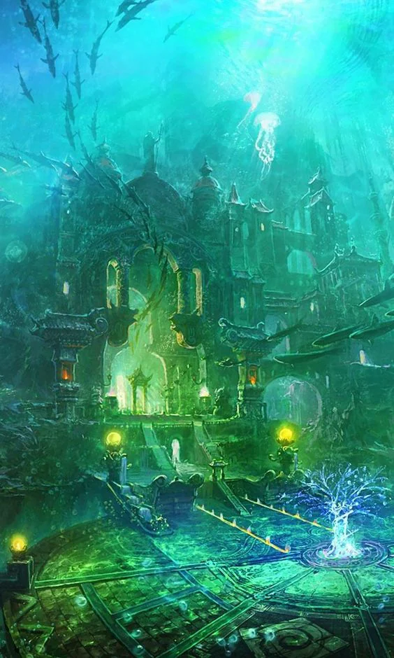
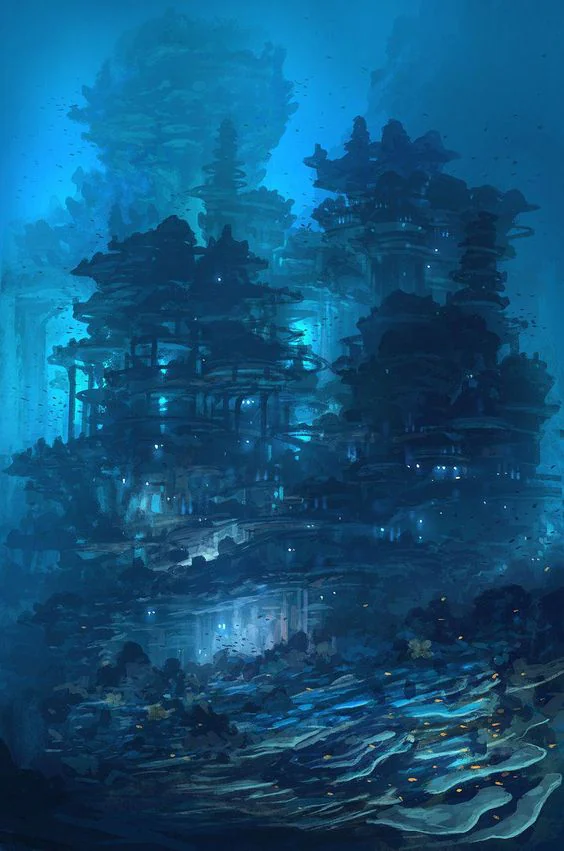

Home of the waterfolk and portal to the elemental plane of Water. They were pushed out when an ancient race was awoken and nearly drove them to extinction.

<!-- onenote-media:start -->
> [!onenote-hero]
> 

> [!onenote-gallery]
> 
<!-- onenote-media:end -->

