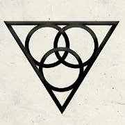

Personification of three elven goddesses (Aerdrie Faenya, Hanali Celanil and [[settings/Spine of the World/Cosmology/Sehanine Moonbow|Sehanine Moonbow]]) she is cconsidered the consort of Corellon in some clerical circles. She is the Goddess who guides to Arvandor, Home to the halls built by Corellon for his children to bask in his presence.

<!-- onenote-media:start -->
> [!onenote-hero]
> 
<!-- onenote-media:end -->

Debate is ongoing as to the nature and identity of Angharrad. Is she One, Three or both singular and plural in nature. Gods are not limited in the same way that we mortals are. Reconciling with our own interpretation of her nature might be the very test we must overcome before being welcomed at her side in the presence of Corellon once we die.

The uncertain and changing nature of the three also plays into the "Reincarnation of Souls" proposal.

-Elmeraz the Wise, Grand Historian and Keeper of Knowledge. "Journal and meditations: 50 Years before the Empire."

<!-- vault-enrichment:start -->
## Related

- [[settings/Spine of the World/Cosmology/index|Religion]]
- [[settings/Spine of the World/index|Spine of the World]]
- [[settings/Spine of the World/Cosmology/Sehanine Moonbow|Sehanine Moonbow]]
<!-- vault-enrichment:end -->
