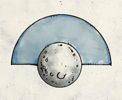

Goddess of Moonlight, The Mystic Seer, The Luminous Cloud and the Lady of Dreams is a central figure of the Seldarine Pantheon and one who is highly regarded as a wise guide for its chief.

<!-- onenote-media:start -->
> [!onenote-hero]
> 
<!-- onenote-media:end -->

She is regarded as the representative of death, dreams, heavens, journeys and the full moon. She is the one who has granted the gift of dream to the Shems. We have transcended past the need for dreams and are now able to enjoy fully her other gifts.

It is also said that she is daughter, consort, friend and shadow of Corellon, Preserver of Life. The uncertainty, mutability and ever changing aspect of Sehanine Moonbow leads us to believe that the Eladrin are the members of our kind most closely related to the gods.

If she is Death and Corellon is life, could they be the two faces of a coin? This would explain the "Reincarnation of Souls" proposed by some scholars I have met on my journeys.

-Elmeraz the Wise, Grand Historian and Keeper of Knowledge. "Journal and meditations: 50 years Before the Empire."

<!-- vault-enrichment:start -->
## Related

- [[settings/Spine of the World/Cosmology/index|Religion]]
<!-- vault-enrichment:end -->
