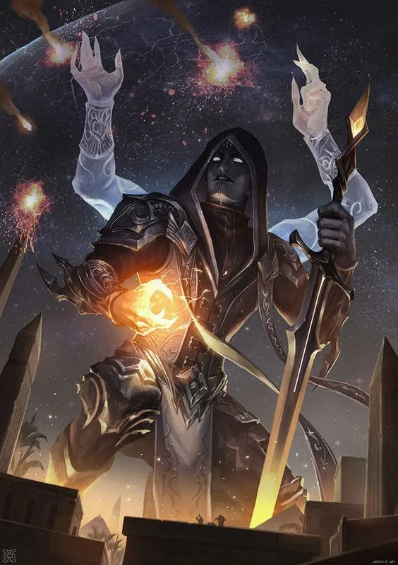
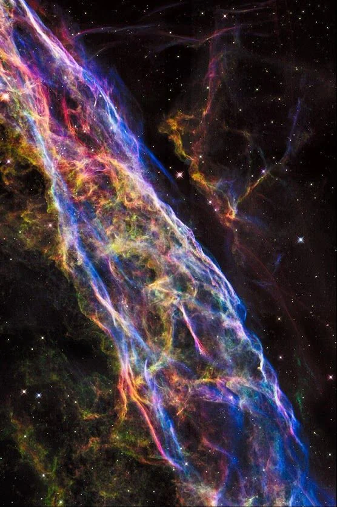
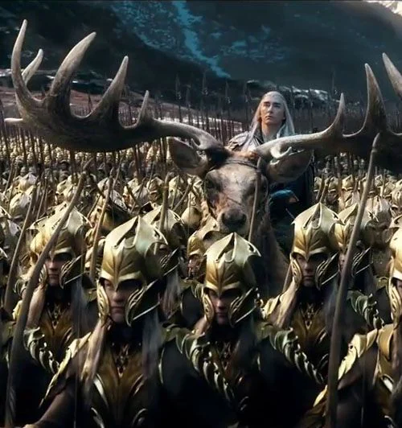

# Myths of Creation:

At first, the universe was but chaos as magical energies, matter, and space moved around wildly.

<!-- onenote-media:start -->
> [!onenote-hero]
> 

> [!onenote-gallery]
> 
>
> 
<!-- onenote-media:end -->

From the mixing of these, came forth the elemental chaos and the birth of Primal forces of the Universe. Creatures coming from chaos were called Primordials. The embodiement of the will of those elements.

Slowly more complex forms of Will were born. The Seldarine chief among them embodied purity and perfection.

As the Seldarine formed the inner planes and created the elves under the leadership of Corellon, other lesser gods grew jealous of the perfected creations of Corellon and sought to destroy them.

The War of Creation erupted. Pitting the Seldarine against the other gods and the Primordials. Overwhelmed by the sheer number of enemies, the marvelous Corellon devised a plan to break his enemies' alliance. He bound the Primordials to the planes of their respective elements as they could not be killed, scattered the other gods to the planes we know they inhabit and sealed off the planes from The Great Old Evils in the Far Realm.

Weakened by the exertion of magicks required to accomplish such a feat, Corellon retreated with his prized children to the Feywild and then to Arvandor to recover. Having recuperated from his wounds and fatigue, it is with Corellon's blessing that Shuraz knew that the elves should begin the difficult task of sharing their gifts with lesser races.

- First treatise of the Cleric of the Seldarine

#

# Establishment of the Empire

The mighty forces of the Empire of Shuraz came to the Prime material plane 3 Yellow Star cycles ago (about 1 millenium). They set out to pacify the mortal races of the plane, drove back the barbaric humans, the cunning gnomes, the stoic dwarves and the wretched orcs.

The orcs proved difficult to deal with but were eventually wiped out mostly and pushed back North in the jungle forests. The remaining races needed guidance to be brought into the righteous light of Corellon and the Seldarine pantheon.

The Empire proceeded to put their work in service of the greater race of elves so that they may learn of the higher calling of the Great Corellon. Shuraz enforced this position for the greater good of these races. The subsequent establishment of elven nobility paved the way to the establishment of the Empire on the Prime plane.

All that was left to do was to appoint the archons and harmony has reigned in the Empire ever since.

-Elmeraz the Wise, Grand Historian and Keeper of Knowledge.

# Heresy:

The so-called "scholars" of the Shems, the human-kind, would have us believe that they gave birth to the gods they worship. They dare claim that their race was not born from the divine but was brought to the Prime by some other means. Their faith is what fuels the heretical pantheon they worship. Preposterous! Heresy! Abomination!

I admit I entertained the idea when I first heard it. I am after all a man of science and try to assess all possibilities. However this cannot be. It makes much more sense to think of the humans as born from their gods who themselves are nothing but visitors from the far realm now trapped with the Glorious Seldarine on this side of the Great Barrier.

If they are right though... No, I shall continue banishing these heretical thoughts from my mind.

-Elmeraz the Wise, Grand Historian and Keeper of Knowledge. "Journal and meditations: Late Years."

<!-- curated-index:start -->
<section class="index-guide">
  
Cosmology

  
At first, the universe was but chaos as magical energies, matter, and space moved around wildly.

  

    <a class="index-route-card" href="/settings/spine-of-the-world/cosmology/aangarahd">Core concepts<strong>Aangarahd</strong><em>Open this entry.</em></a>
    <a class="index-route-card" href="/settings/spine-of-the-world/cosmology/elves-and-sleep">Core concepts<strong>Elves and sleep</strong><em>Open this entry.</em></a>
    <a class="index-route-card" href="/settings/spine-of-the-world/cosmology/sehanine-moonbow">Core concepts<strong>Sehanine Moonbow</strong><em>Open this entry.</em></a>
  

  

    <section class="index-link-group">
      <h3>Core concepts</h3>
      <ul>
        <li><a href="/settings/spine-of-the-world/cosmology/aangarahd">Aangarahd</a></li>
        <li><a href="/settings/spine-of-the-world/cosmology/elves-and-sleep">Elves and sleep</a></li>
        <li><a href="/settings/spine-of-the-world/cosmology/sehanine-moonbow">Sehanine Moonbow</a></li>
      </ul>
    </section>
  

</section>
<!-- curated-index:end -->

<!-- vault-folder-index:start -->
## Pages

- [[settings/Spine of the World/Cosmology/Aangarahd|Aangarahd]]
- [[settings/Spine of the World/Cosmology/Elves and sleep|Elves and sleep]]
- [[settings/Spine of the World/Cosmology/Sehanine Moonbow|Sehanine Moonbow]]
<!-- vault-folder-index:end -->
