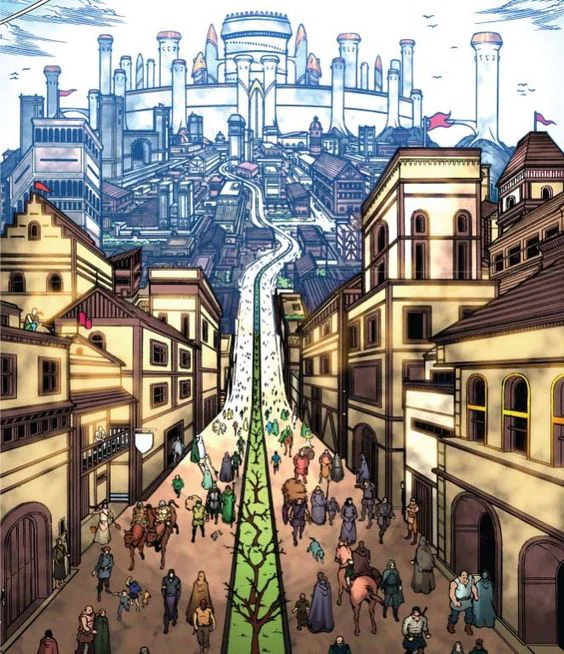

Whitebridge:

<!-- onenote-media:start -->
> [!onenote-hero]
> 

> [!onenote-gallery]
> 
>
> 
<!-- onenote-media:end -->

"Den of thieves and murderers, this town is part of the Empire only in name. Corruption in these parts is rampant and some of the people dealing in shady businesses are sometimes more trustworthy than those appointed by the Empire."

"Nobles?! Never heard of nobility in title or quality of character in that town"

-A traveler

Caemlyn

Heart of the Central plains, city where the archon of Spirit (Laws) presides. This sprawling merchant city presents the opportunities for everyone to start a business and try their luck in the cutthroat world of merchants.

The quill and a good lawyer are your best weapons to navigate here.

Edmond's field

Quiet halfling established according to legends by an Edmond Leafsinger. He is said to have stumbled by some stroke of luck on a plot of land that could be worked and was safe after being chased by wolves.

This quiet community has lived in peace with the Empire since and nothing exceptional has ever happened there.
