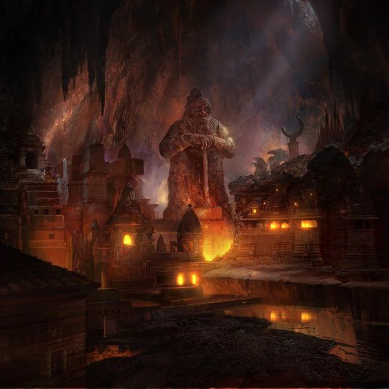
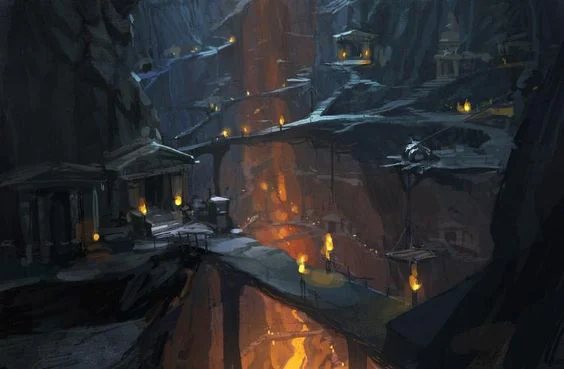

Fractured people after the loss of their last queen to an assassin. The royal bloodline is thought to be extinct.

<!-- onenote-media:start -->
> [!onenote-hero]
> 

> [!onenote-gallery]
> 
<!-- onenote-media:end -->

The tunnels of the mountains are now filled with elementals, [[settings/Spine of the World/Factions/The Drow|drow]] and devils. The city of Umdrummkaz'ad was lost after an uprising of elementals deeper in the mountain.

** Information the party posesses**

- It seems Hrothgar is the last rightful heir to the throne. Unwilling and ashamed of his past actions, his time away from the dwarves might prove to be either an asset or a hindrance if the party is to do something about it.
- The Drow are making Uke in the depths, are somehow involved with the plans of some devil
- The drow are trying to play both the elementals and the devils against the dwarves and each other
- New dwarves have arrived from the Fork area: Goldfoot clanmembers. They are willing to do and ally with anyone willing to go get Umdrumkaz'ad back from the elementals RIGHT NOW!!!!

<!-- vault-enrichment:start -->
## Related

- [[settings/Spine of the World/Factions/index|Spine of the World — Factions]]
- [[settings/Spine of the World/index|Spine of the World]]
- [[settings/Spine of the World/Factions/The Drow|The Drow]]
<!-- vault-enrichment:end -->
