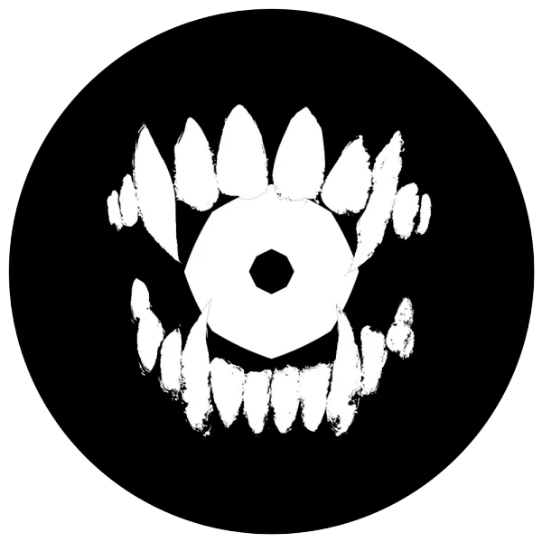

The name that the rebellious movement has given itself.

<!-- onenote-media:start -->
> [!onenote-hero]
> 
<!-- onenote-media:end -->

The territories in the north were always far from the big cities and central powers of the Empire. With the slavery ending, they (humans) demanded complete autonomy. Finding their demands met with a "By Corellon! You must be crazy! No way in the 9 hells we would be doing that!" they decided to find allies elsewhere.... They turned around, and there were the orcs. Historical enemies of the Elves and eager to fight.

Propaganda text found in the northernmost towns of the Empire:

Rise up Free People!

Too long have the elves oppressed us and denied us our rights! Their leader is nowhere to be seen, fighting wars that do not concern us. It is time for us to reclaim what is ours! Rise! Rise and join us!

The folks without Masters! Ris'san Dameno!

<!-- vault-enrichment:start -->
## Related

- [[settings/Spine of the World/Factions/index|Spine of the World — Factions]]
- [[settings/Spine of the World/index|Spine of the World]]
- [[settings/Spine of the World/History/History|History]]
- [[settings/Spine of the World/History/The Story so far|The Story so far]]
<!-- vault-enrichment:end -->
