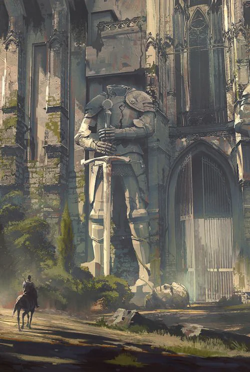

The war of the elven Empire on the human kingdoms seems to have had its most important battle in Salidar.

<!-- onenote-media:start -->
> [!onenote-hero]
> 
<!-- onenote-media:end -->

The siege and conflict finally came to an end with the elves claiming victory.

---INFORMATION KNOWN TO THE PARTY----

With the discovery of the journal of a contemporary of the war, the party has found additional information pertaining to the end of the conflict.

The opposing forces met in a stalemate at Salidar. This stalemate personified by the secret weapon of the humans and Death incarnate, summoned by the demigod leading the elven army.

The elves came to Prime Plane in order to convert people to their religion. The souls of the newly converted would then be harvested and sent to the elven gods to fuel whatever powers or conflict they intended to fight.

It seems one elven commander was inclined to betray the demigod and helped create the curse that would end the battle. Did they really betray the demigod or just the humans? Maybe both were betrayed.

<!-- vault-enrichment:start -->
## Related

- [[settings/Spine of the World/Factions/index|Spine of the World — Factions]]
- [[settings/Spine of the World/index|Spine of the World]]
- [[settings/Spine of the World/Maps/index|Maps]]
<!-- vault-enrichment:end -->
