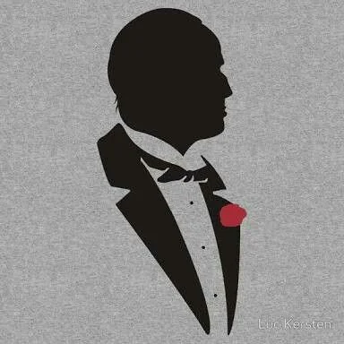

This organization works throughout the continent very much like a mafia: organized racketeering, gambling, theft, prostitution but especially the smuggling of magical artifacts and other rarities in and out of different cities.

<!-- onenote-media:start -->
> [!onenote-hero]
> 
<!-- onenote-media:end -->

They seem to have access to some magical means that are considered to be powerful by the authorities. It is rumored that the Grey Glove is led by an individual only known as The Palm. The inner workings of this group are unknown to those who don't belong or assosciate with them.
