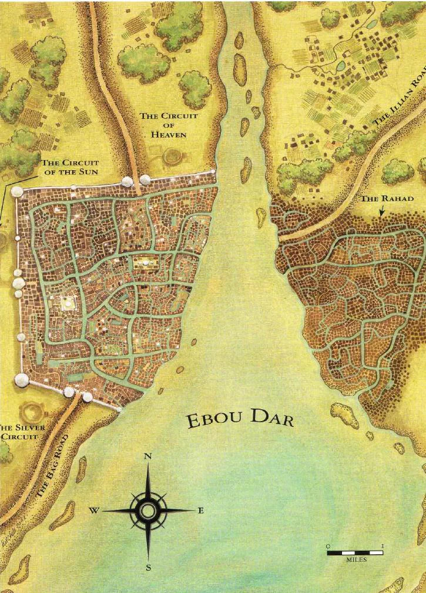
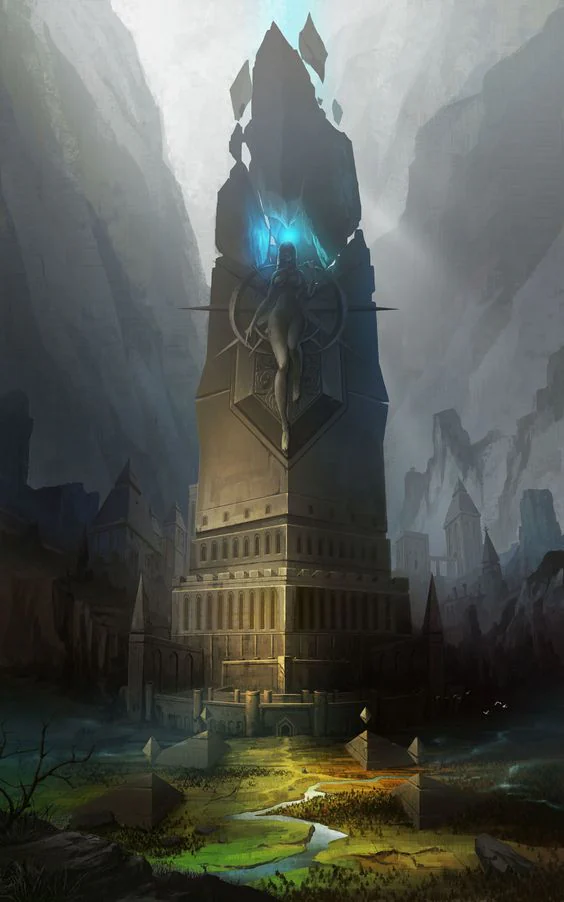

Ebou Dar :

<!-- onenote-media:start -->
> [!onenote-hero]
> 

> [!onenote-gallery]
> 
<!-- onenote-media:end -->

Three towers stand outside of the city on the Western shores of Ebou Dar. They are respectively called from North to South : Circuit of Heaven, Circuit of the Sun and the Silver Circuit.

The humming of the crystal can sometimes be heard on quieter days. They pulse irregularly, usually at a rate of once or twice a month. The pulse is blue in color and can be felt like a low bass sound coursing through the air in the vicinity. This effect is felt usually until the other side of the city.

The compounds that surround the towers are controlled by the military. It is rumored that these crystal were brought with the elves when they first established themselves. Their purpose is unknown, but some speculate if is part of some magic research for some important elven wizard. Maybe under the supervision of the Archon of Secret?

The city itself is split on the two sides of the flowing river. The Eastern bank is composed of mostly poor non-elven individuals

The Western side is inhabited by wealthy nobles and is the location of most trading.
