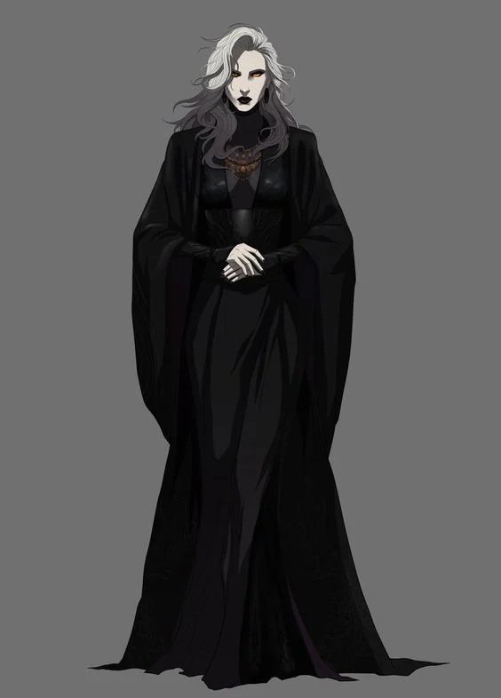

Curse set upon the city in some unholy ritual.

<!-- onenote-media:start -->
> [!onenote-hero]
> 
<!-- onenote-media:end -->

The curse is said to have been set upon a single person during the elven invasion of the Prime Material plane in order to break the stalemate between Death and the Weapon within the city of Salidar. Hoping the humans would be spared and rise again when the enemies god-like leader would be weakened, the curse was sealed deep beneath the city.

The curse is passed on through individuals who already are affected by the curse (bite?blood?).

It starts with better sight and an appetite for blood followed by an aversion to the sun and a bloodlust that is difficult to contain. Individuals can eventually hope to get rid of the hunger. It is unclear what they feed on from that point onwards.

Those who pass on the curse may attempt to force their progeny to do their bidding. This command seems to be hierarchical

<!-- vault-enrichment:start -->
## Related

- [[settings/Spine of the World/Items/index|Spine of the World — Items]]
- [[settings/Spine of the World/index|Spine of the World]]
- [[settings/Spine of the World/History/The Story so far|The Story so far]]
<!-- vault-enrichment:end -->
