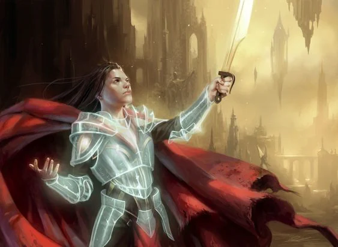
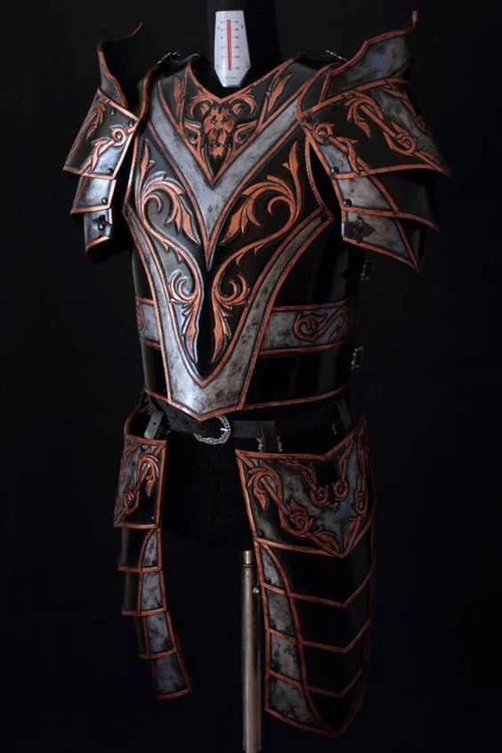
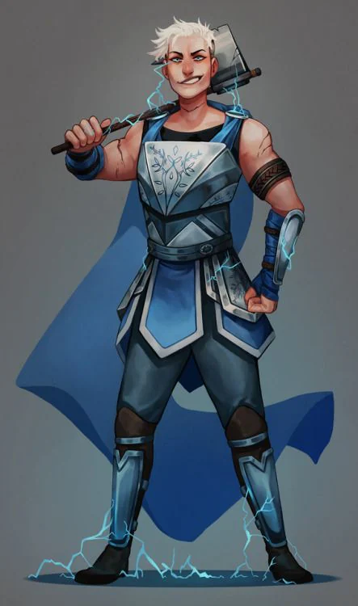

- Salix: Studded leather (+1) (requires attunement). May remove one magical effect on self using a bonus action. Similar mechanics to the Dispel Magic spell.

<!-- onenote-media:start -->
> [!onenote-hero]
> 

> [!onenote-gallery]
> 
>
> 
<!-- onenote-media:end -->

- Kastryd: Mithril chain (+1) (requires attunement). Lightning erupts from the suit of armour if hit. Similar mechanical effect to a 3rd level hellish rebuke at 3rd level with the damage type changed to lightning. (rehcarges on a long rest)

- Callie: Studded leather (+1) (requires attunement) Allows you to switch places with another creature within 30ft, CHA saving throw if the creature is unwilling using your spell save DC or 8+Mental attribute modifier+proficiency bonus if you are not a spellcaster. (3 times per day)

<!-- vault-enrichment:start -->
## Related

- [[settings/Spine of the World/Items/index|Spine of the World — Items]]
- [[settings/Spine of the World/index|Spine of the World]]
<!-- vault-enrichment:end -->
