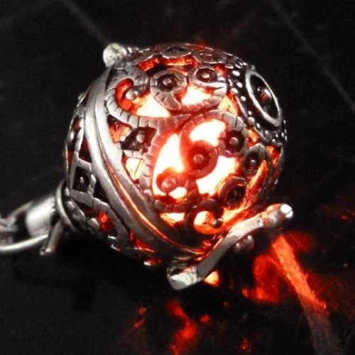

Necklace of the Unbending: This item bestowed by The One Who May Speak In The Name Of Asmodeus, it is the spell focus of the one contractually bound to him. You may decide to siphon some of the power of your patron through it (1 spell slot recovered per long rest as an action). It also increases your Spell Save DC and spell attack bonus by (+1)

<!-- onenote-media:start -->
> [!onenote-hero]
> 
<!-- onenote-media:end -->

<!-- vault-enrichment:start -->
## Related

- [[settings/Spine of the World/Items/index|Spine of the World — Items]]
- [[settings/Spine of the World/index|Spine of the World]]
<!-- vault-enrichment:end -->
