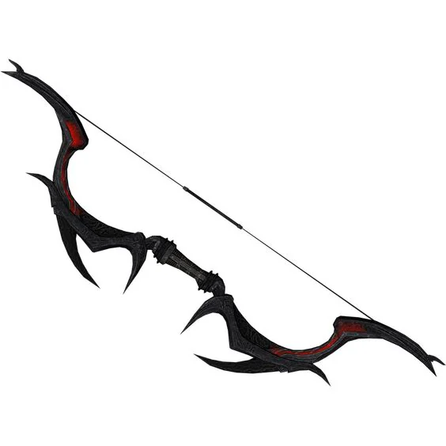
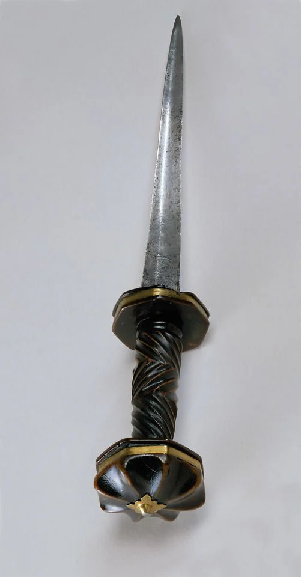

Mercy: (+2 dagger requires attunement) Tool of the one said to be the best assassin in service to a God (to be discovered through lore and investigation in order to determine who this god is). It was said to have been wielded to relieve those of their lives of suffering.

<!-- onenote-media:start -->
> [!onenote-hero]
> 

> [!onenote-gallery]
> 
<!-- onenote-media:end -->

- You may cast Sleep at 3rd level once per day using this dagger (recharges after a long rest)
- You may choose to expend the power of the dager to cause a mortal painless wound to a creature you hit. If successful, the creature must make a DC 18 CON saving throw. If it fails the creature dies without feeling the stab wound, if it succeeds, it takes 10d10 necroitic damage (can only be used once)

Righteous Bow of the Protector: (+2 longbow, requires attunement) Bow bestowed to those who protect the order of things. The wood of this bow has turned light grey and is covered in magical infernal runes by The One Who May Speak In The Name Of Asmodeus. You may invoke its power by saying "I am righteous in striking this enemy".

- The creature marked by the bow takes an additional 3d6 piercing damage when hit. You have advantage to hit them, disadvantage to hit any other creature or when using any other weapons until the target is dead or after 7 days. (recharges on a long rest)

<!-- vault-enrichment:start -->
## Related

- [[settings/Spine of the World/Items/index|Spine of the World — Items]]
- [[settings/Spine of the World/index|Spine of the World]]
<!-- vault-enrichment:end -->
