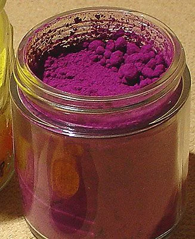

Drug that has made an appearance in [[settings/Spine of the World/Settlements/Ebou Dar|Ebou Dar]] as of late. It is suspected that [[settings/Spine of the World/Organizations/The Grey Glove|the Grey Glove]] is responsible for smuggling this substance into town.

<!-- onenote-media:start -->
> [!onenote-hero]
> 
<!-- onenote-media:end -->

The drug Uke can be ingested, snorted, dilluted in liquid. It gives the user an overwhelming feeling of confidence and sharpens the senses. If taken in too great a quantity, it also may provide minor magical effects.

This drug is extremely addictive and dangerous.

The substance was created by the Archmagister of [[settings/Spine of the World/Settlements/Tar Valon|Tar Valon]], following orders of the Archon of Secrets. A series of experiments were made on gnomes and elven children to study the effects of the substance and refine it. The purpose of creation of this substance is unknown, but the volatility of its effects lends to believe that it might be designed that way.

<!-- vault-enrichment:start -->
## Related

- [[settings/Spine of the World/Items/index|Spine of the World — Items]]
- [[settings/Spine of the World/index|Spine of the World]]
- [[settings/Spine of the World/Settlements/Ebou Dar|Ebou Dar]]
- [[settings/Spine of the World/Organizations/The Grey Glove|The Grey Glove]]
- [[settings/Spine of the World/Settlements/Tar Valon|Tar Valon]]
<!-- vault-enrichment:end -->
