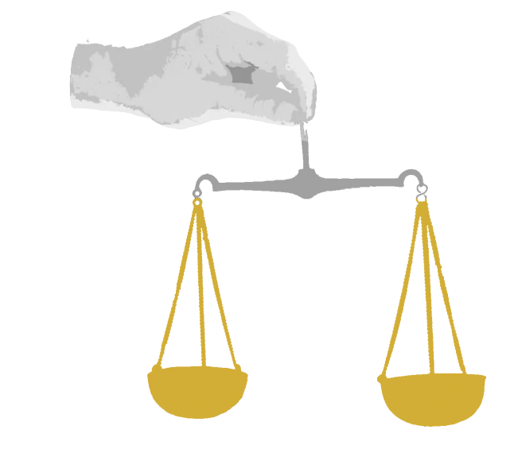

The organized guild of dwarven merchants across the continent. They hire non-humans to work for them. Their influence has grown tremendously since the emancipation of Shems and the rebellion.

<!-- onenote-media:start -->
> [!onenote-hero]
> 
<!-- onenote-media:end -->

<!-- vault-enrichment:start -->
## Related

- [[settings/Spine of the World/Organizations/index|Spine of the World — Organizations]]
- [[settings/Spine of the World/index|Spine of the World]]
- [[settings/Spine of the World/History/History|History]]
<!-- vault-enrichment:end -->
