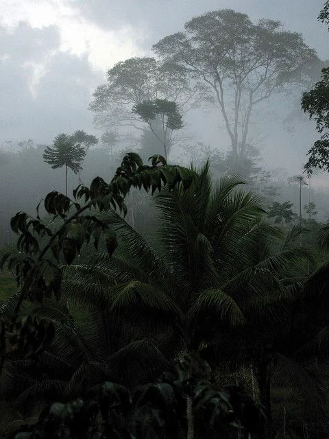

This is a dense tropical forest that has more than just orcs in it.

<!-- onenote-media:start -->
> [!onenote-hero]
> 
<!-- onenote-media:end -->

The dangers that inhabit this forest are also not limited to just wild animals and dangerous creatures. Diseases and the vegetation can be treacherous for those unacustomed. Furthermore, the plant that feeds on living creatures blood keeps growing rapidly and is expected to encompass a large portion of the forest.

<!-- vault-enrichment:start -->
## Related

- [[settings/Spine of the World/Regions/index|Spine of the World — Regions]]
- [[settings/Spine of the World/index|Spine of the World]]
- [[settings/Spine of the World/Maps/index|Maps]]
<!-- vault-enrichment:end -->
