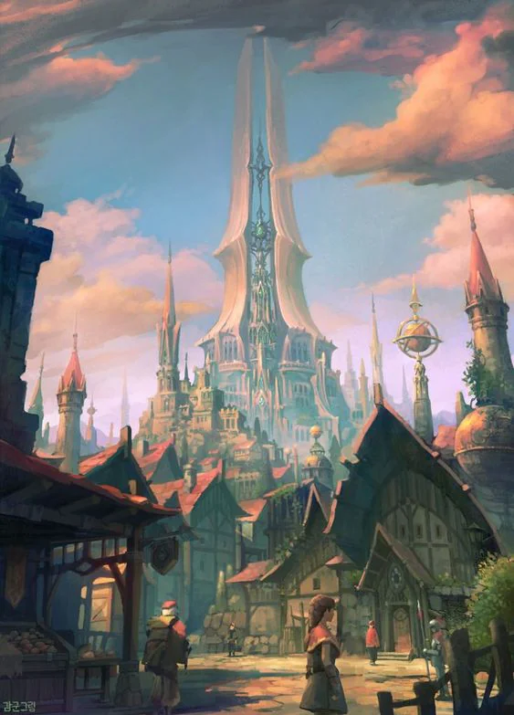
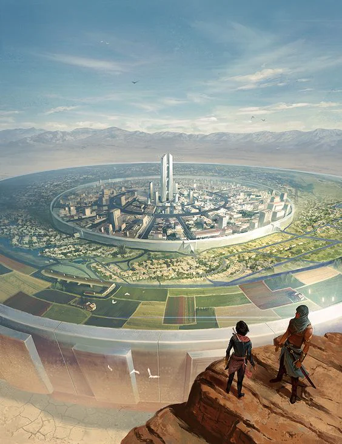

Capital city and center of power for the Empire. The city is also called the Marble Spire. The city was built using magic. The roads are made of white marble stone. The houses seem to be made of single carved white stone.

<!-- onenote-media:start -->
> [!onenote-hero]
> 

> [!onenote-gallery]
> 
<!-- onenote-media:end -->

- It is a large  circular city that sports a tall white marble tower in it center. This tower is the seat of power where the Archons convene and summon the nobility as deemed necessary.
- An academy of magicks lies to the west of the city.
- The closer to the center of the city, the more important you must be.

The city itself is largely unaligned, but access to an Archon's ear is a precious commodity and the local nobles are largely interested in currying favors towards them and influencing the laws concerning their businesses.

<!-- vault-enrichment:start -->
## Related

- [[settings/Spine of the World/Settlements/index|Spine of the World — Settlements]]
- [[settings/Spine of the World/index|Spine of the World]]
- [[settings/Spine of the World/History/History|History]]
- [[settings/Spine of the World/History/The Story so far|The Story so far]]
- [[settings/Spine of the World/Items/Uke|Uke]]
- [[settings/Spine of the World/Maps/index|Maps]]
<!-- vault-enrichment:end -->
