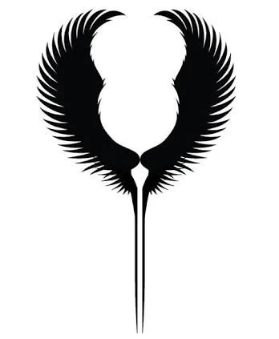
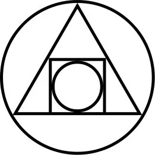

Shuraz : Supreme Emperor of All the PLanes

<!-- onenote-media:start -->
> [!onenote-hero]
> 

> [!onenote-gallery]
> 
<!-- onenote-media:end -->

Mysterious character who is at the head of the Empire. They reside in their palace in the Feywild and is rumored to be dealing with more important matters than the Prime Material from there.

Shuraz hasn't been seen in the Prime for nearly 2000 years.

4 Archons to rule in Their stead

4 Archons, representative of the authhority of Shuraz on the Prime Material plane while They sit on Their throne in the Feywild.

Archon of Fire : In charge of the Economy (Smaller Circle)

Archon of Stone: In charge of the Security (Big Circle)

Archon of Spirit: In charge of Laws (Square)

Archon of Secrets: In charge of magical balance (Triangle)

<!-- vault-enrichment:start -->
## Related

- [[settings/Spine of the World/index|Spine of the World]]
<!-- vault-enrichment:end -->
