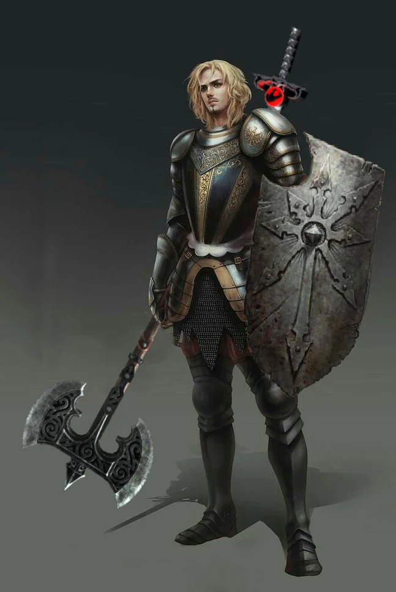
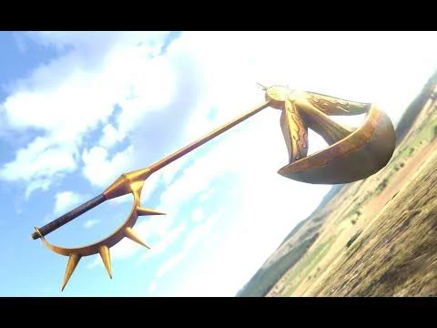

Crusade veteran, he was foretold of a great future in which he will have a crucial part ot play.

<!-- onenote-media:start -->
> [!onenote-hero]
> 

> [!onenote-gallery]
> 
<!-- onenote-media:end -->

Fortune reading: Wheel of fortune (inverted) an omen of bad luck, failure and utter defeat. It is/will be time to reassess the situation, cut your losses  and forge your way forward. Bad luck can only last so long.

Orphan raised in the monastery by Anthony. Left at the door

Oprhans from Pelfort: Nina

Knight of the Delian Order, has the axe called Dawn

Dawn: (recharges after a long rest)

3/day, you can teleport up to 30ft using a bonus action

All creatures within 5ft of the location you have vacate, must do a CON saving throw (DC 14) or be blinded until the start of your next turn
