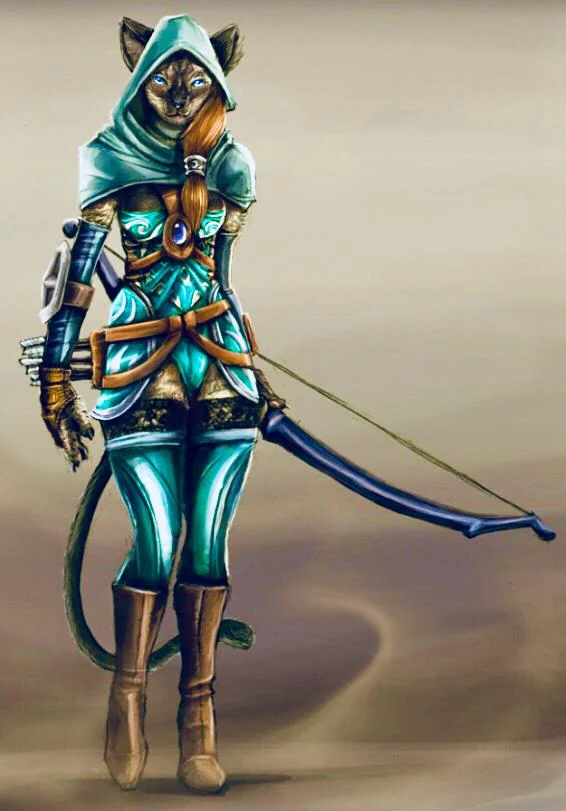

Fugitive because of her heirloom. Kissa is now on a quest to find out more about this strange gift given to her by her grandmother. The secret of the conflict between the wizards and the thieves guild could be the beginning of something even more dangerous than escaping Orso and the circus.

<!-- onenote-media:start -->
> [!onenote-hero]
> 
<!-- onenote-media:end -->

She has discovered much about her family and their ties with the wizards. Her grandmother seems to have been there at the very beginning of the conflict when the Eye was first discovered and that Orso sought to obtain it. Kissa's grandmother also encountered Ueli to whom she gave the Cape of 9 Lives.

Card reading: chariot

Augustina grandmother

Divine Eye:

Glimpses of the future begin to press in on your awareness. When you finish a long rest, roll two d20s and record the numbers rolled. You can replace any attack roll, saving throw, or ability check made by you or a creature that you can see with one of these foretelling rolls. You must choose to do so before the roll, and you can replace a roll in this way only once per turn.

Each foretelling roll can be used only once. When you finish a long rest, you lose any unused foretelling rolls.

….More?

Wookie circus

Wicka assassins
