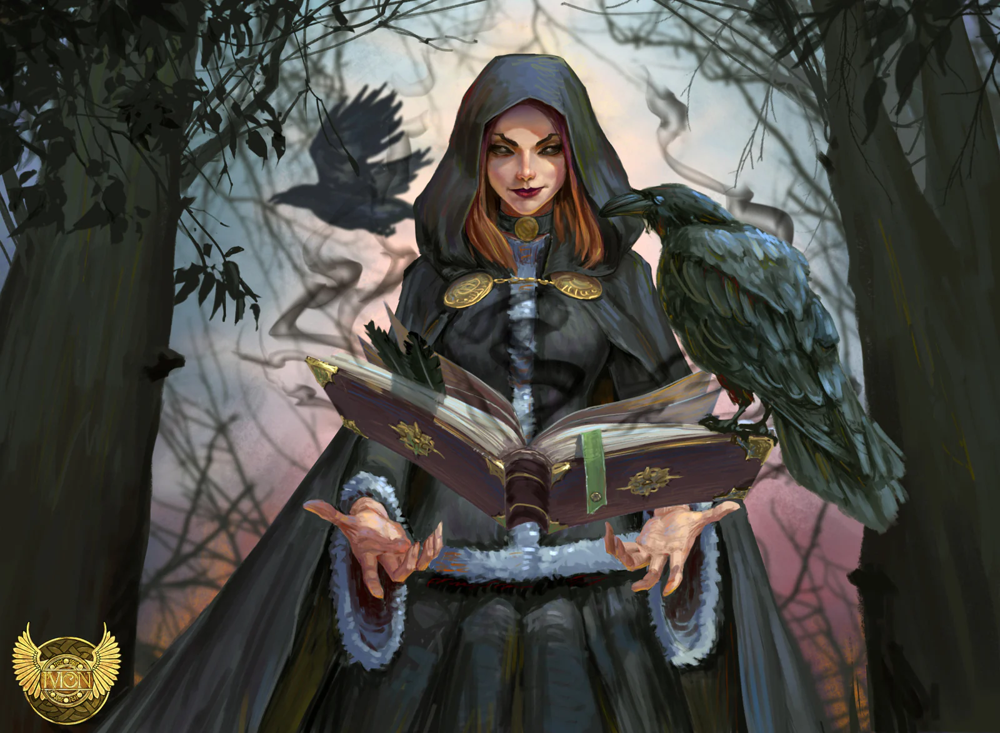

Wizard apprentice. Her master disappeared in strange circumstances. Outlawed by other wizards, she seeks answers and it seems they are linked to the strange necklace of [[settings/Tales of Fate/Campaign/Players/Kissa|Kissa]] and Orso.

<!-- onenote-media:start -->
> [!onenote-hero]
> 
<!-- onenote-media:end -->

Ueli: her master, seems to have turned into a lich. She thinks he is being controlled.

She is tempted by power but wants to do good.

Card reading: Wizard,

<!-- vault-enrichment:start -->
## Related

- [[settings/Tales of Fate/Campaign/Players/index|Players]]
- [[settings/Tales of Fate/index|Tales of Fate]]
- [[settings/Tales of Fate/Campaign/index|Tales of Fate — Campaign]]
- [[settings/Tales of Fate/History/History of the world|History of the world]]
- [[settings/Tales of Fate/History/Season 1|Season 1]]
- [[settings/Tales of Fate/Organizations/Ministry of Magic|Ministry of Magic]]
- [[settings/Tales of Fate/Settlements/Barathia|Barathia]]
- [[settings/Tales of Fate/Settlements/Ueli's Tower|Ueli's Tower]]
<!-- vault-enrichment:end -->
